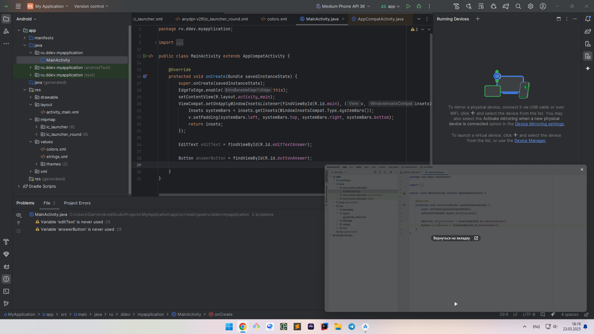

Day 2
---

Начало продолжается. 

Минутка юмора. 

> "У нас было 2 среды разработки, 3 курса, 1 официальный сайт, 5 разных книг от O'Reilly, куча задач с Codewars и целое множество ответов на StackOverflow и флуда в чатах всех сортов и расцветок. Не то что бы это был необходимый запас для изучения Android. Но если начал разрабатывать свои приложения, становится трудно остановиться. Единственное что вызывало у меня опасение - это Coroutines. Нет ничего более беспомощного, безответственного и испорченного, чем deadlocks, race-condition и потоков-зомби. Я знал, что рано или поздно мы перейдем и на эту дрянь."

## Сделано сегодня
- 1 задача на codewars (7kyu пока что)
- Продолжил проходить курс на [Stepic](https://stepik.org/course/121507/). Выполняю первое дз - Calculator aka [GuessNumber](https://github.com/DeveloperDanila/GuessNumber)
- Почитал книгу Программирование на Kotlin для Android

Курс

Книга

